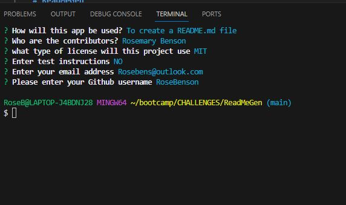

# ReadMeGen

## Description
I have created a READme.md generator command line app, which when given imput by the user generates a unique and quick READme.md file for their project. 

When a user enters the project title, it's displayed as the title of the README.

When a user enters a description, installation instructions, usage information, contribution guidelines, and test instructions, this information is added to the sections of the README entitled Description, Installation, Usage, Contributing, and Tests.When a user clicks on the links in the Table of Contents, they are taken to the corresponding section of the README.

## Table of Contents 

- [Usage](#usage)
- [Installation](#installation)
- [Technologies](#technologies)
- [License](#license)

## Usage

#### Access the application on: - 

[Link to video explaning usage](https://drive.google.com/file/d/1-2c3QsJ9nRLHKfzKOVjYTB1b_AavrWRL/view)

#### Apperance of the command line:

## Installation

#### Clone repository using SSH:
    - Click on the "Code" button and select "SSH"
    - Copy the SSH URL provided
    - In your terminal, navigate to the directory where you want to clone the repository
    - Run the command: git clone <SSH_URL> : replacing <SSH_URL> with the copied SSH URL.

#### NPM INSTALLATION

## Technologies 

- Javascript
- Node.js

## License

- MIT Lisence

